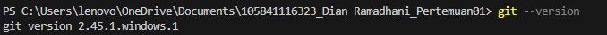
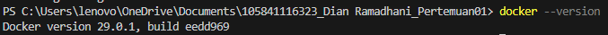
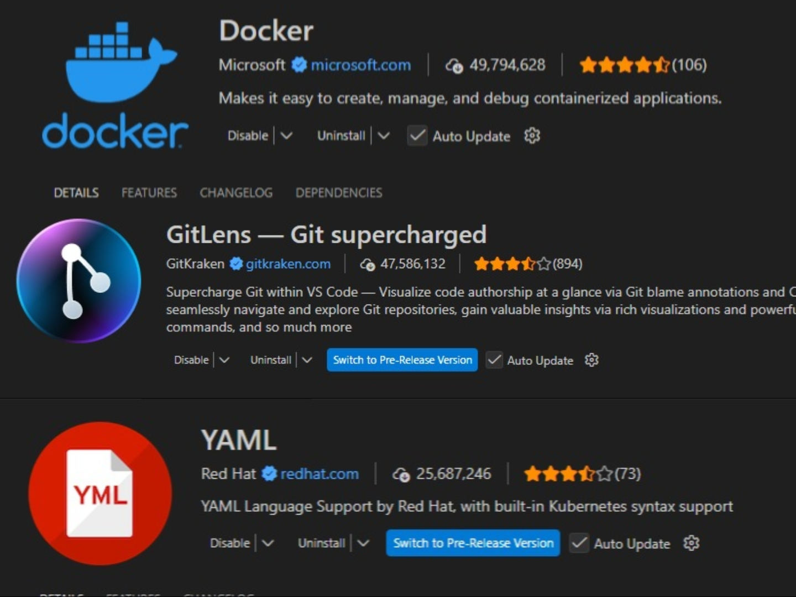

# Laporan Praktikum DevOps — Pertemuan 01

## 👤 Identitas
- Nama: Dian Ramadhani  
- NIM: 105841116323  

---

## 📌 Pengertian DevOps

DevOps adalah pendekatan dalam pengembangan perangkat lunak yang menggabungkan tim development (Dev) dan operations (Ops) untuk meningkatkan kolaborasi, otomatisasi, serta kecepatan dalam proses pengiriman software. DevOps menekankan praktik seperti continuous integration, continuous delivery, dan automation infrastructure.

---

## ⭐ Mengapa DevOps Penting

DevOps penting karena mampu mempercepat siklus pengembangan perangkat lunak sekaligus meningkatkan kualitas dan stabilitas sistem. Dengan DevOps, proses build, testing, dan deployment dapat dilakukan secara otomatis sehingga mengurangi kesalahan manual. Selain itu, DevOps meningkatkan kolaborasi antar tim, mempercepat time-to-market, serta membuat sistem lebih mudah diskalakan dan dipelihara.

---

## 🖥️ Environment yang Telah Disiapkan

### ✅ Git

Git telah berhasil diinstal dan dikonfigurasi pada sistem.

---

### ✅ Docker Desktop

Docker Desktop telah terpasang dan berjalan dengan baik.

---

### ✅ Visual Studio Code

Visual Studio Code telah diinstal beserta extensions yang diperlukan:

- Docker  
- GitLens  
- YAML  

---

## ✅ Kesimpulan

Lingkungan pengembangan DevOps telah berhasil disiapkan dengan menginstal Git, Docker Desktop, dan Visual Studio Code beserta extensions pendukung. Environment ini siap digunakan untuk praktikum DevOps selanjutnya.