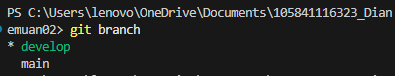
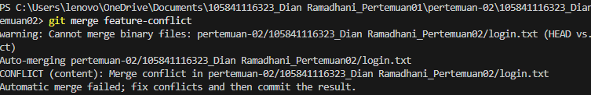

# Laporan Praktikum DevOps CI/CD – Pertemuan 02

## Identitas
Nama : Dian Ramadhani  
NIM  : 105841116323  

---

## Deskripsi Praktikum
Pada pertemuan ini dilakukan praktik penggunaan GitFlow untuk mengelola workflow repository, mulai dari pembuatan feature, proses release, hingga simulasi dan penyelesaian merge conflict.

---

## Implementasi GitFlow

Repository diinisialisasi menggunakan GitFlow dengan branch utama **main** dan branch pengembangan **develop**.

Setelah itu dibuat feature branch dengan nama **feature/login** dari branch develop.  
Pada branch ini ditambahkan file `login.txt` sebagai simulasi fitur login dan kemudian dilakukan commit.

Feature yang telah selesai kemudian digabungkan kembali ke branch develop.

Selanjutnya dibuat release dengan versi **v1.0**, dilakukan commit untuk persiapan release, lalu release tersebut digabungkan ke branch **main** dan otomatis dibuat tag **v1.0**. Setelah itu perubahan dikembalikan lagi ke branch develop.

### Screenshot GitFlow Branch

---

## Simulasi Merge Conflict

Merge conflict dibuat dengan cara mengubah file yang sama pada dua branch yang berbeda, yaitu:

- Branch develop → Login Version B  
- Branch feature-conflict → Login Version A  

Ketika kedua branch digabungkan, terjadi conflict pada file `login.txt`.

Conflict diselesaikan secara manual dengan memilih isi file yang sesuai, kemudian dilakukan add dan commit kembali hingga proses merge berhasil.

### Screenshot Merge Conflict

